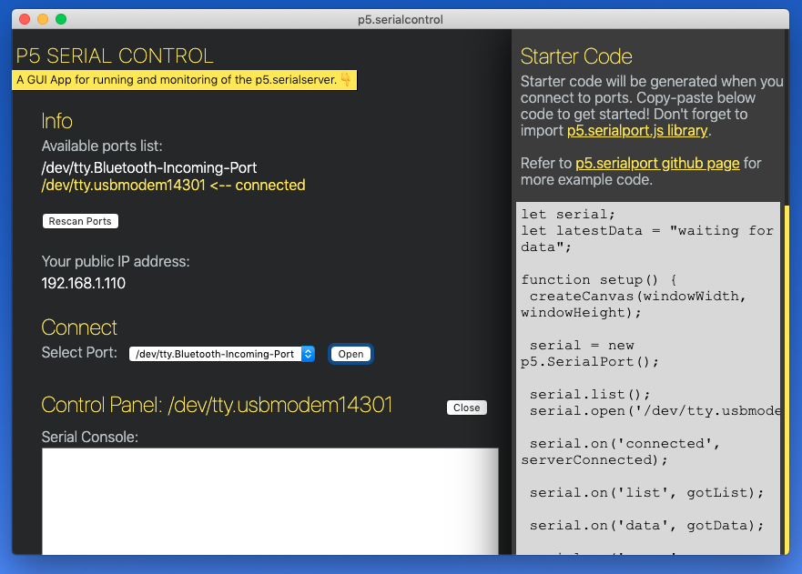

# Serial Communication Checklist

## Check 1 - Arduino
* Your Arduino is connected to your computer 
* The Arduino IDE sofware registers your Arduino board at a paricular port. In this example, the port is `usbmodem14301`: 
* You uploaded the correct Arduino sketch to your Arduino
* Everything is wired correctly
* The Arduino IDE's Serial Monitor is NOT open

## Check 2 - p5.serialcontrol App
* The p5.serialcontrol app is running and the port to which your Arduino is connected is open and connected. Notice again that the port is `usbmodem14301`: 


## Check 3 - p5 Web Editor
* Your p5.js sketch includes the p5.serialport library file in the sidebar. (Don't have one? Not to worry: you can make one! Click `Add File` from the sidebar dropdown menu, title the file `p5.serialport.js`, click `Add File` in the pop-up window to actually add it, and into that file copy and paste the p5.Serial code from an example project.)
 
* Your p5.js sketch knows to use the p5.serialport library by referencing it in your project's `index.html` file like this: 
  ```
  <body>
    <script src="p5.serialport.js"></script>
    <script src="sketch.js"></script>
  </body>
  ```
* Your p5.js sketch is sending data to the same port to which your Arduino is connected. Look for this method in your p5.js setup() function to update the port number. (There's that `usbmodem14301` port again.)
    ```
    serial.open("/dev/tty.usbmodem14301");
    ``` 
* Bonus! This last one is not related to serial communication, but you should check it anyway. Make sure your p5.js sketch also includes the ml5.js library by referencing it in the `index.html` file. Look for this line between the `header tags`.
    ```
    <script src="https://unpkg.com/ml5@0.3.1/dist/ml5.min.js" type="text/javascript"></script>
    ```